# 🏗️ DataOps Project - Architecture Diagrams

> **Visual representation of the complete DataOps pipeline architecture**
> Version: 1.0 | Last Updated: 2024-01-15

---

## 📋 Table of Contents

1. [High-Level Architecture](#high-level-architecture)
2. [Data Flow Architecture](#data-flow-architecture)
3. [Infrastructure Architecture](#infrastructure-architecture)
4. [CI/CD Pipeline Architecture](#cicd-pipeline-architecture)
5. [DBT Model Lineage](#dbt-model-lineage)
6. [Deployment Architecture](#deployment-architecture)
7. [Network Architecture](#network-architecture)

---

## 🌐 High-Level Architecture

---

## 🔄 Data Flow Architecture

### Medallion Architecture (Bronze → Silver → Gold)

```mermaid
graph LR
    subgraph "Source"
        S1[SalesOrderHeader]
        S2[SalesOrderDetail]
        S3[Customer]
        S4[Person]
        S5[Product]
        S6[ProductCategory]
    end

    subgraph "Bronze Layer<br/>(Staging)"
        B1[brnz_sales_orders<br/>VIEW]
        B2[brnz_customers<br/>VIEW]
        B3[brnz_products<br/>VIEW]
    end

    subgraph "Silver Layer<br/>(Business Logic)"
        SL1[slvr_sales_orders<br/>TABLE]
        SL2[slvr_customers<br/>TABLE]
        SL3[slvr_products<br/>TABLE]
    end

    subgraph "Gold Layer<br/>(Analytics Marts)"
        G1[gld_sales_summary<br/>TABLE]
        G2[gld_customer_metrics<br/>TABLE]
        G3[gld_product_performance<br/>TABLE]
    end

    subgraph "Consumers"
        C1[📊 Power BI]
        C2[📈 Tableau]
        C3[🔬 Jupyter]
    end

    S1 --> B1
    S2 --> B1
    S3 --> B2
    S4 --> B2
    S5 --> B3
    S6 --> B3

    B1 --> SL1
    B2 --> SL2
    B3 --> SL3

    SL1 --> G1
    SL2 --> G2
    SL3 --> G3

    G1 --> C1
    G2 --> C1
    G3 --> C1

    G1 --> C2
    G2 --> C2
    G3 --> C2

    G1 --> C3
    G2 --> C3
    G3 --> C3

    style B1 fill:#ffd54f
    style B2 fill:#ffd54f
    style B3 fill:#ffd54f
    style SL1 fill:#c0c0c0
    style SL2 fill:#c0c0c0
    style SL3 fill:#c0c0c0
    style G1 fill:#ffd700
    style G2 fill:#ffd700
    style G3 fill:#ffd700
```

### Data Transformation Flow

---

## 🏢 Infrastructure Architecture

### Docker Compose Stack

### Container Dependencies

---

## 🚀 CI/CD Pipeline Architecture

### Complete CI/CD Flow

```mermaid
graph TB
    subgraph "Developer Workflow"
        A1[Developer<br/>Creates Feature Branch]
        A2[Push Code<br/>to GitHub]
        A3[Create Pull Request]
    end

    subgraph "CI Pipeline (Pull Requests)"
        B1[DBT Test Workflow<br/>✅ Compile, Parse, Debug]
        B2[Lint Workflow<br/>✅ SQL, Python, YAML]
        B3[PR Validation Workflow<br/>✅ Title, Description, Files]
    end

    subgraph "Code Review"
        C1{All CI Checks Pass?}
        C2[Code Review<br/>by Team Member]
        C3{Approved?}
    end

    subgraph "CD Pipeline (Deployment)"
        D1{Which Branch?}
        D2[Deploy to Dev<br/>develop branch]
        D3[Deploy to Prod<br/>main branch]

        D4[Pre-Deployment Checks]
        D5[Create Backup<br/>Production Only]
        D6[Run dbt deps]
        D7[Run dbt run]
        D8[Run dbt test]
        D9[Source Freshness Check]
        D10[Generate Documentation]
        D11[Health Check]
        D12[Send Notifications]
    end

    subgraph "Post-Deployment"
        E1{Deployment Success?}
        E2[✅ Merge Complete]
        E3[❌ Rollback Triggered]
        E4[Restore Previous Version]
        E5[Post-Incident Review]
    end

    A1 --> A2 --> A3
    A3 --> B1 & B2 & B3
    B1 --> C1
    B2 --> C1
    B3 --> C1

    C1 -->|Pass| C2
    C1 -->|Fail| A1
    C2 --> C3
    C3 -->|Yes| D1
    C3 -->|No| A1

    D1 -->|develop| D2
    D1 -->|main| D3

    D2 --> D4
    D3 --> D4

    D4 --> D5
    D5 --> D6
    D6 --> D7
    D7 --> D8
    D8 --> D9
    D9 --> D10
    D10 --> D11
    D11 --> D12

    D12 --> E1
    E1 -->|Yes| E2
    E1 -->|No| E3
    E3 --> E4 --> E5

    style B1 fill:#e8f5e9
    style B2 fill:#e8f5e9
    style B3 fill:#e8f5e9
    style D7 fill:#fff3e0
    style E2 fill:#4caf50
    style E3 fill:#f44336
```

### CI Workflow Details

### CD Workflow Details

---

## 📊 DBT Model Lineage

### Complete Data Lineage

```mermaid
graph TD
    subgraph "Source Tables"
        S1[(SalesOrderHeader)]
        S2[(SalesOrderDetail)]
        S3[(Customer)]
        S4[(Person)]
        S5[(Product)]
        S6[(ProductCategory)]
        S7[(ProductSubcategory)]
    end

    subgraph "Bronze Layer (Staging)"
        B1[brnz_sales_orders<br/>─────────────<br/>📄 VIEW<br/>🔑 sales_order_id<br/>📦 ~32K rows]
        B2[brnz_customers<br/>─────────────<br/>📄 VIEW<br/>🔑 customer_id<br/>📦 ~19K rows]
        B3[brnz_products<br/>─────────────<br/>📄 VIEW<br/>🔑 product_id<br/>📦 ~500 rows]
    end

    subgraph "Silver Layer (Business Logic)"
        SL1[slvr_sales_orders<br/>─────────────<br/>📊 TABLE<br/>🔑 order_detail_id<br/>📦 ~121K rows<br/>+ time_intelligence<br/>+ order_categorization<br/>+ shipping_metrics]
        SL2[slvr_customers<br/>─────────────<br/>📊 TABLE<br/>🔑 customer_id<br/>📦 ~19K rows<br/>+ RFM_segmentation<br/>+ lifetime_value<br/>+ customer_lifecycle]
        SL3[slvr_products<br/>─────────────<br/>📊 TABLE<br/>🔑 product_id<br/>📦 ~500 rows<br/>+ performance_metrics<br/>+ profitability<br/>+ sales_trends]
    end

    subgraph "Gold Layer (Analytics)"
        G1[gld_sales_summary<br/>─────────────<br/>🥇 TABLE<br/>🔑 order_date<br/>📦 ~1.5K rows<br/>+ daily_aggregates<br/>+ moving_averages<br/>+ YTD_metrics]
        G2[gld_customer_metrics<br/>─────────────<br/>🥇 TABLE<br/>🔑 customer_id<br/>📦 ~19K rows<br/>+ customer_360<br/>+ churn_prediction<br/>+ CLV_analysis]
        G3[gld_product_performance<br/>─────────────<br/>🥇 TABLE<br/>🔑 product_id<br/>📦 ~500 rows<br/>+ product_KPIs<br/>+ inventory_insights<br/>+ recommendations]
    end

    %% Source to Bronze
    S1 -->|SalesOrderID<br/>OrderDate<br/>CustomerID| B1
    S2 -->|SalesOrderDetailID<br/>ProductID<br/>OrderQty| B1
    S3 -->|CustomerID<br/>PersonID| B2
    S4 -->|BusinessEntityID<br/>FirstName<br/>LastName| B2
    S5 -->|ProductID<br/>Name<br/>ListPrice| B3
    S6 -->|ProductCategoryID<br/>Name| B3
    S7 -->|ProductSubcategoryID<br/>Name| B3

    %% Bronze to Silver
    B1 -->|Enrich & Transform| SL1
    B2 -->|Calculate RFM| SL2
    B3 -->|Add Metrics| SL3

    %% Silver to Gold
    SL1 -->|Aggregate by Date| G1
    SL2 -->|Customer 360 View| G2
    SL3 -->|Product KPIs| G3

    %% Cross-layer relationships
    SL1 -.->|customer_id| SL2
    SL1 -.->|product_id| SL3

    style S1 fill:#e3f2fd
    style S2 fill:#e3f2fd
    style S3 fill:#e3f2fd
    style S4 fill:#e3f2fd
    style S5 fill:#e3f2fd
    style S6 fill:#e3f2fd
    style S7 fill:#e3f2fd
    style B1 fill:#fff9c4
    style B2 fill:#fff9c4
    style B3 fill:#fff9c4
    style SL1 fill:#e0e0e0
    style SL2 fill:#e0e0e0
    style SL3 fill:#e0e0e0
    style G1 fill:#fff9c4,stroke:#ffd700,stroke-width:3px
    style G2 fill:#fff9c4,stroke:#ffd700,stroke-width:3px
    style G3 fill:#fff9c4,stroke:#ffd700,stroke-width:3px
```

### Column-Level Lineage Example (Sales Orders)

---

## 🌍 Deployment Architecture

### Multi-Environment Architecture

### Deployment Flow with Approvals

```mermaid
sequenceDiagram
    participant Dev as Developer
    participant GH as GitHub
    participant CI as CI Pipeline
    participant DevEnv as Dev Environment
    participant StagingEnv as Staging Environment
    participant ProdEnv as Production Environment
    participant Slack as Slack Notifications

    Dev->>GH: Push to feature branch
    GH->>CI: Trigger CI workflows
    CI->>CI: Run DBT tests
    CI->>CI: Run linting
    CI->>CI: Validate PR
    CI-->>GH: CI status ✅

    Dev->>GH: Create Pull Request
    GH->>Dev: Request code review
    Dev->>GH: Approve PR

    Dev->>GH: Merge to develop
    GH->>DevEnv: Auto deploy
    DevEnv->>DevEnv: Run DBT models
    DevEnv->>DevEnv: Run tests
    DevEnv-->>Slack: Deployment success

    Note over Dev,DevEnv: Test in Dev for 1-2 days

    Dev->>GH: Merge develop → main
    GH->>ProdEnv: Auto deploy

    ProdEnv->>ProdEnv: Pre-deployment checks
    ProdEnv->>ProdEnv: Create backup
    ProdEnv->>ProdEnv: Run DBT models
    ProdEnv->>ProdEnv: Run tests
    ProdEnv->>ProdEnv: Health checks

    alt Deployment Success
        ProdEnv-->>Slack: ✅ Deployment success
        ProdEnv-->>GH: Update deployment status
    else Deployment Failure
        ProdEnv->>ProdEnv: Auto rollback
        ProdEnv-->>Slack: ❌ Deployment failed (rolled back)
        ProdEnv-->>Dev: Create incident ticket
    end
```

---

## 🌐 Network Architecture

### Docker Network Topology

### Security Architecture

---

## 📊 Performance Architecture

### Query Optimization Strategy

---

## 📈 Scalability Architecture

### Horizontal Scaling Strategy

---

## 📝 Diagram Legend

### Symbols and Colors

### Node Types

- **Cylinder** [(Database)]: Database or storage system
- **Rectangle** [Service]: Application service or component
- **Diamond** {Decision}: Conditional logic or gateway
- **Stadium** ([Event]): Event or trigger point

### Color Coding

| Color | Meaning | Example |
|-------|---------|---------|
| Light Blue (#e3f2fd) | Source Systems | SQL Server source tables |
| Yellow (#fff9c4) | Bronze Layer | Staging views |
| Gray (#e0e0e0) | Silver Layer | Business logic tables |
| Light Yellow (#fffde7) | Gold Layer | Analytics marts |
| Purple (#f3e5f5) | Orchestration | Airflow components |
| Green (#4caf50) | Success | Successful deployment |
| Red (#f44336) | Failure | Failed deployment |

---

## 🔗 Related Documentation

- **Architecture Overview**: [ARCHITECTURE.md](./ARCHITECTURE.md)
- **Data Lineage Details**: [DATA_LINEAGE.md](./DATA_LINEAGE.md)
- **Deployment Runbook**: [DEPLOYMENT_RUNBOOK.md](./DEPLOYMENT_RUNBOOK.md)
- **CI/CD Guide**: [CI_CD_GUIDE.md](./CI_CD_GUIDE.md)
- **Multi-Environment Setup**: [MULTI_ENVIRONMENT_SETUP.md](./MULTI_ENVIRONMENT_SETUP.md)

---

**Last Updated**: 2024-01-15
**Maintained By**: Data Engineering Team
**Version**: 1.0

For questions or updates, please create an issue or contact the data engineering team.
